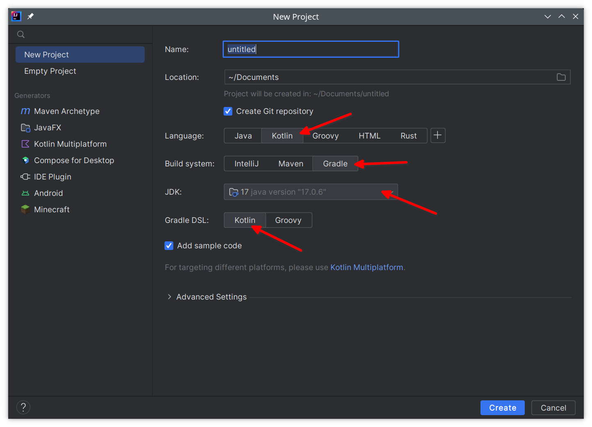
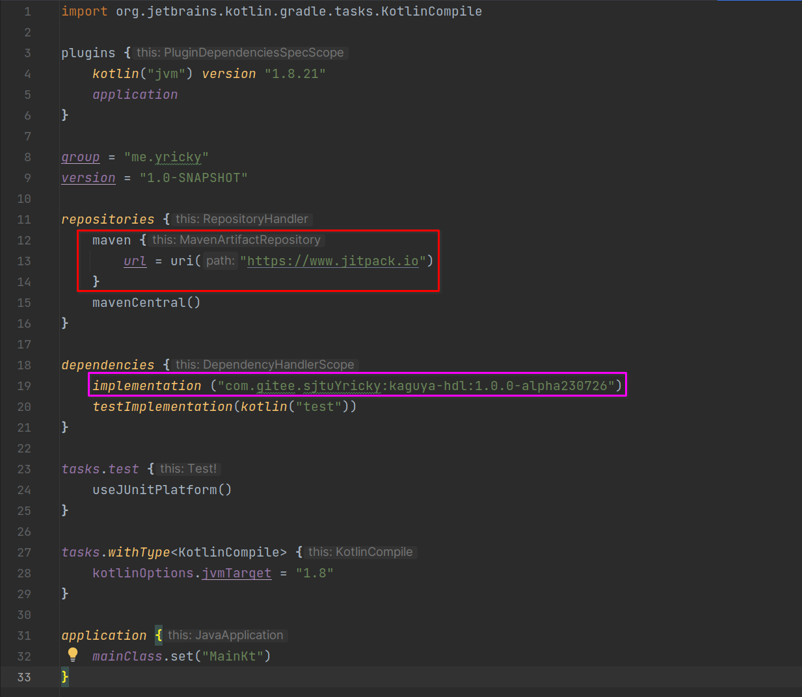

# 第一个KaguyaHDL项目

## 新建项目

使用IntelliJ Idea创建新项目，按照如下配置创建：

要点：
- 语言选择Kotlin，显而易见
- 构建系统推荐选择gradle，因为教程就是这么走的
- JDK版本选择17，没有的话可以到下拉框里面Add SDK下载一个17版本的
- Gradle DSL语言推荐选择Kotlin

## 添加KaguyaHDL依赖包

创建好项目之后，打开 `build.gradle.kts` 文件，添加如下方框内容：

要点：
- 红色方框，为你的项目添加jitpack源，KaguyaHDL的包托管在这里
- 紫色方框，为你的项目添加KaguyaHDL依赖。最好添加最新版本，目前的最新版本为：
[](https://jitpack.io/#com.gitee.sjtuYricky/kaguya-hdl)

添加好后，点击右上角按钮同步整个项目

## 第一行代码

要开始正式写代码了！现在让我们打开`src/main/kotlin/Main.kt`，这是idea为我们自动添加的源码文件。

尝试在main函数写下如下代码并点击左边的三角运行一下吧

```kotlin
fun main(args: Array<String>) {
    val module = module("inv"){
        inputWire("in").inv().exportAsOutput("out")
    }
    println(KaguyaVerilogCompiler().compile(module))
}
```
> 代码解析：构建了一个名为`inv`的模块，该模块声明了一个名为`in`的输入信号，并将这个信号的取反导出为名为`out`的输出信号。随后将该模块使用内置的VerilogCompiler编译器编译后打印到控制台中。

运行结果为：
```verilog
module inv(
    input in,
    output out
);
    assign out = ~in;
endmodule
```


